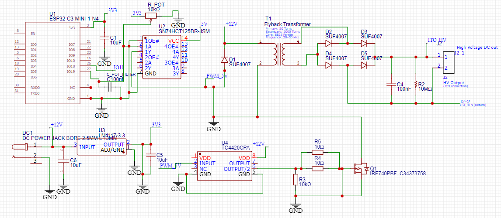
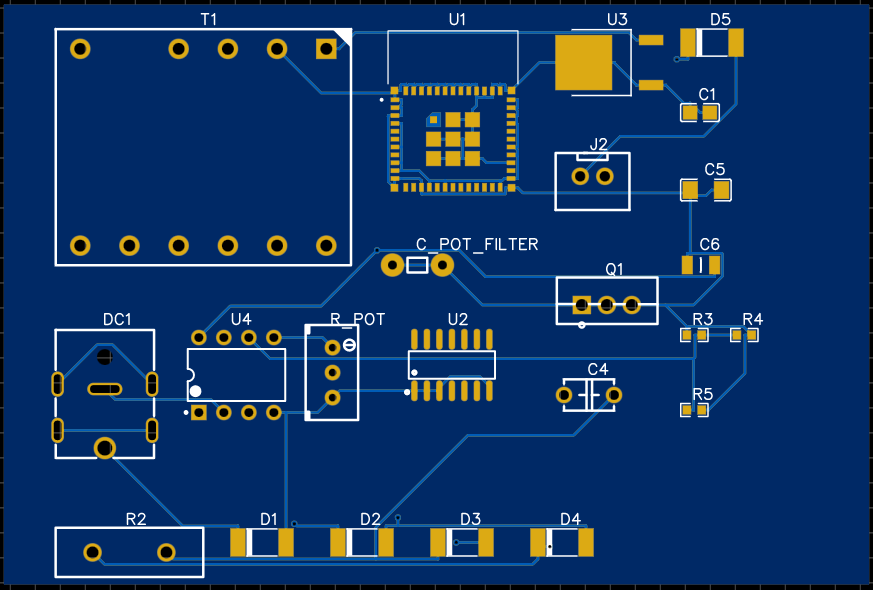
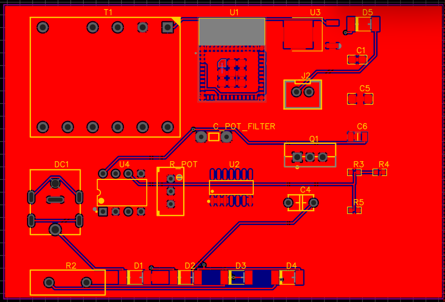
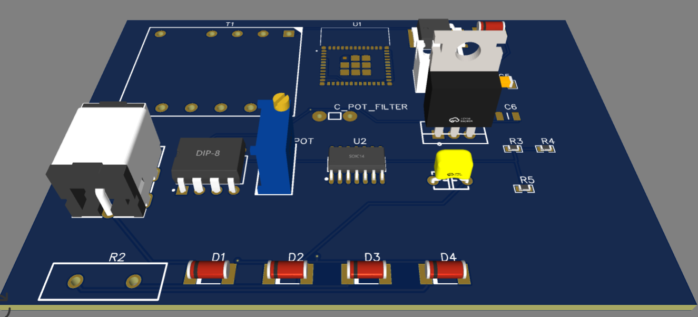

# DustShield Digital Twin

An interactive, browser-based 3D digital twin and operations control dashboard for the **Electrodynamic Dust Shield (EDS)** lunar mission. This application visualizes lunar orbit navigation, surface landing, and real-time EDS physics simulation to clear electrostatic dust from solar panels.

## 🚀 Live Simulation Features

### 1. 3D Lunar Orbit & Navigation
- **Photorealistic Moon & Space Environment**: Renders a textured 3D Moon using high-resolution NASA albedo maps (`assets/nasa/moon.jpg`) suspended in a realistic space skybox with custom procedural starfields.
- **Automated Cinematic Descent**: Initiates an automated descent sequence after a brief orbital telemetry initialization sequence (approx. 6.5s), transitioning the viewport down to the lunar landing site.
- **Dynamic Transition**: Smoothly blends the 3D scene from the global lunar view into the localized lunar surface group and terrain.

### 2. Lunar Surface Operations & 3D Rover View
- **NASA Lunar Rover Integration**: Loads a 3D GLTF rover model (`assets/nasa/rover.glb`) situated directly on the lunar dust bed. A procedurally generated high-fidelity landing pad/rover fallback is rendered if the asset is missing.
- **Focused Camera Zoom**: The camera focuses directly on the rover's solar panels where the dust accumulation and clearing simulation takes place.

### 3. Electrodynamic Dust Shield (EDS) Simulation
- **AC Traveling-Wave Clearing Physics**: Simulates the multi-phase AC high-voltage traveling-wave electrostatic forces used to lift and transport charged lunar regolith particles off the solar panels.
- **Accurate Surface Physics**: Utilizes precision raycasting and tangential plane projection to ensure dust particles correctly slide across any sloped panel surface and realistically detach off edges without relying on artificial bounding boxes.
- **Auto-Shutdown & Efficiency**: EDS efficiently clears dust and gracefully auto-shutdowns at a <=1% residual coverage threshold to accurately lock in and preserve net energy recovery metrics.
- **Interactive Controls Panel**: Real-time configuration inputs:
  - **Voltage (V_pp) Slider**: Adjusts the electrostatic potential strength. Higher voltages clear dust faster and handle heavier particles.
  - **Frequency (Hz) Slider**: Alters the propagation speed of the traveling wave.
  - **Phase Mode Selector**: Toggles between 2-Phase and 3-Phase AC wave configurations to optimize travel characteristics.
- **Dust Coverage Telemetry**: Real-time readouts displaying remaining dust coverage percentage, active solar panel efficiency (inversely proportional to dust coverage), and electrostatic field status.

### 4. Telemetry & Hardware Integration HUD
- **Mission Status Indicators**: Visual warnings and alerts (e.g. system status, high voltage warning, signal quality).
- **Mock MCU / UART Terminal**: Toggleable hardware serial console mimicking an ESP32/MCU UART interface. Shows mock telemetry payloads, status frames, and allows manual control sequence injections.

---

##  Scientific Energy Recovery Model

The digital twin implements an empirical solar attenuation model based on the Beer-Lambert law to simulate how dust coverage degrades solar cell efficiency and to compute the net energy recovered during electrodynamic clearing.

### 1. Attenuation & Transmission Model
The transmission factor of light through the dust layer $T(C)$ is modeled as an exponential decay function of the dust coverage percentage $C$ ($0 \le C \le 100$):

$$T(C) = e^{-K \cdot C}$$

Where:
- $T(C)$ is the fraction of light transmitted to the solar cells ($0 \le T \le 1$).
- $K = 0.03$ is the dust attenuation coefficient, calibrated to match lunar regolith spectral absorption and scattering data.

### 2. Instantaneous Solar Power Output
The instantaneous power output of the solar panel array $P(C)$ at any coverage level $C$ is calculated as:

$$P(C) = P_{\text{max}} \cdot T(C) = P_{\text{max}} \cdot e^{-K \cdot C}$$

Where:
- $P_{\text{max}} = 240 \text{ W}$ is the peak power output when the solar panels are completely clean ($C = 0\%$).

### 3. Baseline (Fully Dusty) Power
When the solar panel is completely covered in dust ($C = 100\%$), it still generates a minimal amount of power from diffuse or ambient scattered light:

$$P_{\text{base}} = P_{\text{max}} \cdot e^{-K \cdot 100} = 240 \cdot e^{-0.03 \cdot 100} = 240 \cdot e^{-3} \approx 11.95 \text{ W}$$

### 4. Instantaneous Power Recovered
The power recovered ($P_{\text{recovered}}$) relative to the worst-case fully dusty baseline is:

$$P_{\text{recovered}}(C) = \max\left(0, P(C) - P_{\text{base}}\right)$$

### 5. Net Energy Recovered Accumulation
The total net energy recovered ($E_{\text{recovered}}$, in Watt-hours) is the time-integral of the recovered power, accumulated only while the electrostatic dust shield (EDS) is actively clearing dust (i.e. when the EDS is active and $C > 0$):

$$E_{\text{recovered}} = \int_{t_{\text{start}}}^{t_{\text{end}}} P_{\text{recovered}}(t) \, dt \approx \sum_{t} \frac{P_{\text{recovered}}(t) \cdot \Delta t}{3600}$$

Where:
- $\Delta t$ is the simulation time step between animation frames (in seconds).
- The factor of $3600$ converts seconds to hours to yield energy in Watt-hours ($\text{Wh}$).

---

## 📁 Project Structure

```bash
DustShield/
├── assets/
│   └── nasa/
│       ├── moon.jpg          # Moon surface texture map
│       ├── moon_albedo.jpg   # High resolution lunar albedo map
│       ├── rover.glb         # 3D GLTF model of the lunar rover
│       └── moon_small.glb    # Lightweight moon 3D geometry
├── firmware/
│   └── firmware.ino          # ESP32-C3 hardware control firmware (C++/Arduino)
├── gerber/
│   ├── How-to-order-PCB.txt  # Instructions for PCB manufacturing
│   └── *.DRL, *.G*, etc.     # Production-ready Gerber PCB fabrication files
├── hardware/
│   ├── BOM_dustshield_final_2026-06-11.csv       # Bill of Materials
│   ├── PCB_dustshield_final_2026-06-11.pcbdoc    # EasyEDA PCB design project source file
│   ├── schematic.png         # Circuit Schematic View
│   ├── photoview.png         # Photorealistic Render View
│   ├── pcb_top&bottom.png    # Top/Bottom Track routing Layout
│   ├── 3dview.png            # 3D PCB render
│   └── 2d view.png           # 2D outline representation
├── index.html                # Main HUD dashboard and 3D container layout
├── index.css                 # Glassmorphic premium dashboard styling & animations
├── main.js                   # Three.js rendering engine, descent/ascent logic, & EDS physics loop
├── CSS_TOKENS.css            # Standardized UI colors, spacing, and styling tokens
├── DESIGN_SYSTEM.md          # Architectural specifications of the user experience
└── README.md                 # Project documentation (this file)
```

---

## 🛠️ How to Run Locally

### 1. Retrieve Large 3D Assets (Git LFS)
This repository uses **Git LFS (Large File Storage)** to manage the binary 3D assets (e.g., `.glb` models for the Moon globe and rover). If you cloned the repository without Git LFS active, you will only have small text pointer files, which will cause Three.js loading errors.

Before running the application, make sure Git LFS is installed and pull the binary files:
```bash
# Ensure Git LFS is installed on your system (e.g., 'brew install git-lfs' on macOS)
git lfs install

# Pull the binary assets
git lfs pull
```

### 2. Run the Local HTTP Server
Since the application uses Three.js and loads external assets via Web APIs, running it directly by double-clicking the `index.html` file will trigger CORS security blocks in your browser. 

Please run it through a local web server:

1. **Open your terminal** and navigate to the project directory:
   ```bash
   cd /path/to/DustShield
   ```

2. **Start a local HTTP server** using Python:
   ```bash
   python3 -m http.server 8000
   ```

3. **Open your browser** and navigate to:
   [http://localhost:8000](http://localhost:8000)


---

## 🛠️ Hardware Schematics & PCB Design

The Electrodynamic Dust Shield (EDS) physical subsystem utilizes a high-voltage driver board and an electrode array designed to generate multi-phase AC traveling electrostatic waves.

### Hardware Layout Specification
- **Electrode Trace Width**: 0.4 mm copper traces optimized for uniform electrostatic charge distribution.
- **Gap Spacing**: 0.6 mm spacing between adjacent electrode traces, designed to prevent high-voltage breakdown and arcing in low-pressure environments.
- **3-Phase AC Electrode Routing**: An interdigitated electrode pattern on the top layer, routed using a 3-phase network (Phases A, B, and C) connected through vias to the bottom layer to generate a continuous traveling-wave field.
- **Driver Circuitry**: Built around an ESP32-C3-MINI-1-N4 microcontroller driving a high-speed TC4420 driver and a flyback transformer circuit to step up the low-voltage input to high-voltage AC waveforms.

### Schematic & Design Views

| View Type | Image |
| :--- | :--- |
| **Circuit Schematic** |  |
| **Photorealistic Render** |  |
| **PCB Top & Bottom Layout** |  |
| **3D PCB Render** |  |
| **2D PCB Layout** |  |

### Bill of Materials (BOM)

The following components are required for assembling the EDS high-voltage driver board (as specified in [BOM_dustshield_final_2026-06-11.csv](hardware/BOM_dustshield_final_2026-06-11.csv)):

| ID | Component Name | Designator | Footprint | Qty | Manufacturer Part | Manufacturer | Supplier Part (LCSC) |
| :--- | :--- | :--- | :--- | :---: | :--- | :--- | :--- |
| 1 | 10uF | C1 | C0805 | 1 | CC0805X5R16V106MN | TORCH(火炬) | C53084529 |
| 2 | 100nF | C4 | CAP-TH_L5.1-W3.2-P5.08-D0.50 | 1 | C320C104K3G5TA7301 | KEMET(基美) | C2308177 |
| 3 | 10uF | C5 | C1206 | 1 | CL31A106KAHNNNE | SAMSUNG(三星) | C9807 |
| 4 | 10uF | C6 | CAPC3216X180N | 1 | - | - | - |
| 5 | C100nf | C_POT_FILTER | C100NF | 1 | - | - | - |
| 6 | SUF4007 | D1, D2, D3, D4, D5 | DO-213AB_L5.0-W2.5-RD | 5 | SUF4007 | DIOTEC(德欧泰克) | C212757 |
| 7 | DC Power Jack 2.5mm | DC1 | DC-IN-TH_L13.0-W10.0-332114NA0 | 1 | DC Power Jack bore 2.5mm L 13mm | - | C9900076240 |
| 8 | ITO_HV (Screw Terminal) | J2 | SCREW_TERMINAL 2WAY | 1 | Screw terminal 2p | - | - |
| 9 | IRF740PBF N-Ch MOSFET | Q1 | TO-220AB-3_L10.0-W4.5-P2.54-L | 1 | IRF740PBF | OSEN(欧芯) | C34373758 |
| 10 | 10MΩ | R2 | 12Z-2010 | 1 | - | - | - |
| 11 | 10kΩ | R3 | R0603 | 1 | 0603WAF1002T5E | UNI-ROYAL(厚声) | C25804 |
| 12 | 10Ω | R4, R5 | R0603 | 2 | 0603WAF100JT5E | UNI-ROYAL(厚声) | C22859 |
| 13 | 10kΩ Potentiometer | R_POT | RES-ADJ-TH_3296W | 1 | 3296W-1-103LF | BOURNS | C34846 |
| 14 | Flyback Transformer | T1 | - | 1 | - | - | - |
| 15 | ESP32-C3-MINI-1-N4 | U1 | XCVR_ESP32-C3-MINI-1-N4 | 1 | - | - | - |
| 16 | SN74HCT125DR-JSM Buffer | U2 | SOIC-14_L8.7-W3.9-P1.27-LS6.0-BL | 1 | SN74HCT125DR-JSM | JSMSEMI(杰盛微) | C53436286 |
| 17 | LM1117-3.3 LDO | U3 | TO-252-2_L6.6-W6.1-P4.58-LS9.7-BR-1 | 1 | LM1117-3.3 | - | C2887172 |
| 18 | TC4420CPA MOSFET Driver | U4 | DIP-8_L9.8-W6.6-P2.54-LS7.6-BL | 1 | TC4420CPA | MICROCHIP(美国微芯) | C48733 |

---

## ⚙️ Technologies Used
- **Three.js** (loaded via CDN) for the web-based WebGL 3D rendering pipeline.
- **HTML5 & Vanilla Javascript (ES6+)** for application logic, physics simulation, and state management.
- **Vanilla CSS3** featuring CSS variables, modern flexbox/grid layout systems, glassmorphism filters, and CSS keyframe animations.
- **EasyEDA** for electronic hardware schematic design, PCB layout routing, and production-ready manufacturing outputs (Gerber files).
- **C++ & Arduino** for the micro-controller firmware targeting the ESP32-C3 platform.

